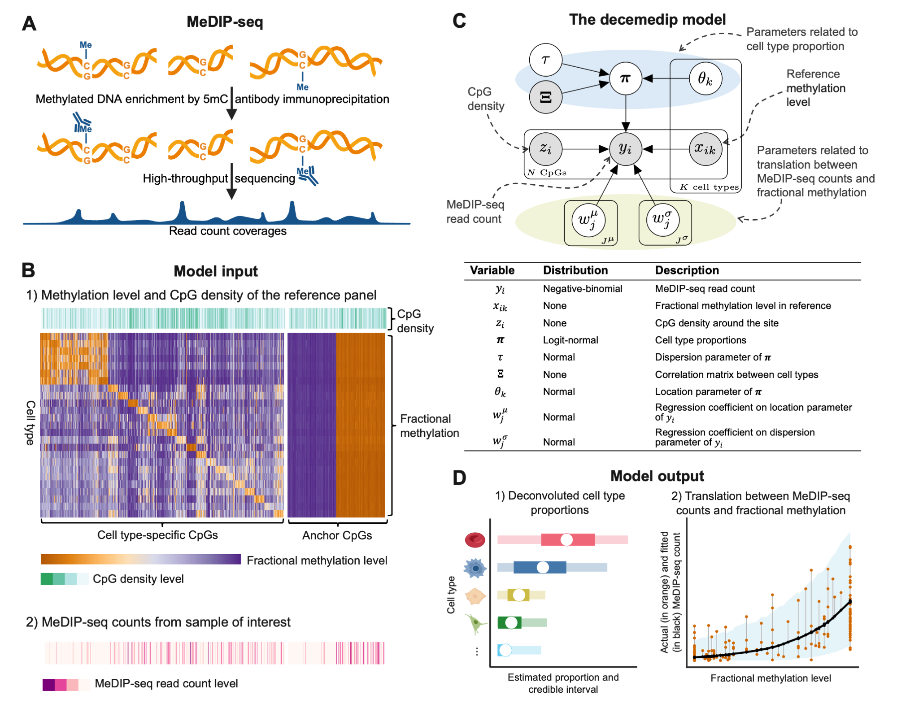

<p align="center">
  
</p>

# decemedip: Cell type deconvolution of cell‑free DNA via Bayesian hierarchical modeling

The R package `decemedip` is a novel computational paradigm developed for inferring the relative abundances of cell types and tissues from tissue bulk or circulating cell-free DNA (cfDNA) measure by methylated DNA immunoprecipitation sequencing (MeDIP-Seq). This paradigm allows using reference data from other technologies such as microarray or WGBS.



## Installation

You can install the development version of `decemedip` in R from
[GitHub](https://github.com/) with:

``` r
# install.packages("devtools")
devtools::install_github("nshen7/decemedip")
```

## Usage

An online vignette on the decemedip package can be found at https://rpubs.com/nshen7/how-to-use-decemedip.  

## How to get help for decemedip

If you have questions or suggestions regarding the decemedip package, please feel free raise an issue in this GitHub page or alternatively email the author, Ning, at ning.shen.wk@gmail.com.


## Citation

*decemedip: hierarchical Bayesian modeling for cell type deconvolution of immunoprecipitation-based DNA methylomes*. Ning Shen, Ze Zhang, Sylvan Baca, Keegan Korthauer. *bioRxiv* (2025). [https://doi.org/10.1101/2025.05.09.653152](https://doi.org/10.1101/2025.05.09.653152)

