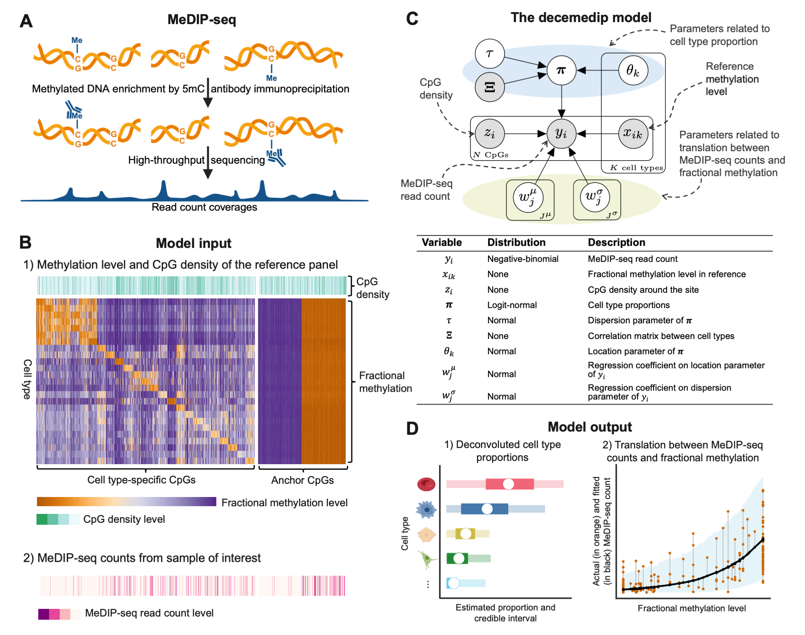
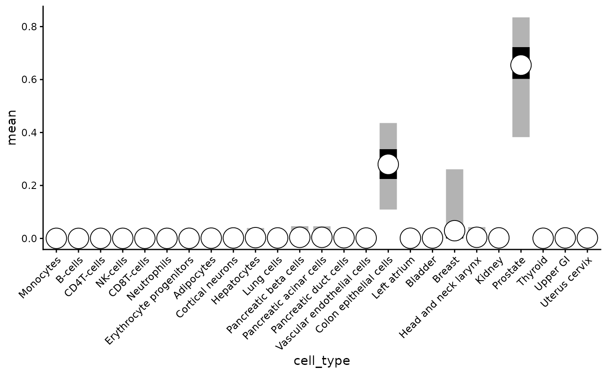
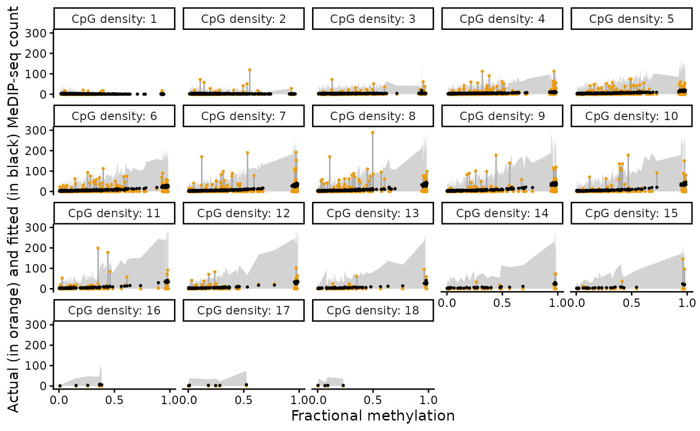

# Cell type deconvolutiond of (cf)MeDIP-seq data with decemedip

## Citation

**If you use decemedip in published research, please cite:**

Shen, Ning, and Keegan Korthauer. “decemedip: hierarchical Bayesian
modeling for cell type deconvolution of immunoprecipitation-based DNA
methylome” bioRxiv, forthcoming.

## Installation

This package will be submitted to Bioconductor. For now, you can install
the development version from GitHub:

``` r

# Install stable version from Bioconductor (once available)
# BiocManager::install("decemedip")

# Install development version from GitHub
remotes::install_github("nshen7/decemedip")
```

After installation, load the decemedip package:

``` r

library(SummarizedExperiment)
library(dplyr)
library(ggplot2)
library(decemedip)
options(digits = 2)
```

## Background

Cell-free and bulk DNA methylation data obtained through MeDIP-seq
reflect a mixture of methylation signals across multiple cell types.
Decomposing these signals to infer cell type composition can provide
valuable insights for cancer diagnosis, immune response monitoring, and
other biomedical applications. However, challenges like
enrichment-induced biases and sparse reference data make this task
complex. The `decemedip` package addresses these challenges through a
hierarchical Bayesian framework that estimates cell type proportions and
models the relationship between MeDIP-seq counts and reference
methylation data.

decemedip couples a logit-normal model with a generalize additive model
(GAM) framework. For each site $`i \in \{1, ..., N\}`$ in the reference
panel, the input to the model is the fractional methylation levels
$`x_{ik}`$ for each cell type $`k \in \{1, ..., K\}`$, the CpG density
level $`z_i`$ and the MeDIP-seq read count $`y_i`$, where $`K`$ is the
total number of cell types. A unit simplex variable that follows a
logit-normal prior, $`\boldsymbol{\pi} = (\pi_1, ..., \pi_K)`$ where
$`\pi_k > 0, \sum_{k=1}^K \pi_k = 1`$, is included to describe the
proportions of cell types in the reference panel while taking into
account the correlations between these cell types.



## Input Data

`decemedip` requires three primary inputs:

1.  **Reference methylation matrix**: A matrix of methylation levels for
    multiple cell types at selected CpG sites.
2.  **CpG density**: Information about CpG site density in the genome.
3.  **MeDIP-seq read counts**: Coverage values from the sample of
    interest.

### Reference panel

Our package provides default reference matrices for hg19 and hg38 along
with the corresponding CpG density information, as objects in class
`SummarizedExperiment`. The objects can be accessed by calling
`data(hg19.ref.cts.se)` and `data(hg19.ref.anc.se)`, or
`data(hg38.ref.cts.se)` and `data(hg38.ref.anc.se)`. By default, the
main function
[`decemedip()`](https://nshen7.github.io/decemedip/reference/decemedip.md)
applies `hg19.ref.cts.se` and `hg19.ref.anc.se` as the reference panels.
Please refer to the manuscript for details of how the default reference
panels were constructed.

On a side note, we provide the function
[`makeReferencePanel()`](https://nshen7.github.io/decemedip/reference/makeReferencePanel.md)
to allow user to build their own reference panels, which only requires
input of reference CpGs and corresponded fractional methylation level
matrix. The function computes CpG density on its own. Note that the cell
type-specific sites and anchor sites need to be included in two
`SummarizedExperiment` objects to be inputs to the main function
[`decemedip()`](https://nshen7.github.io/decemedip/reference/decemedip.md).
See
[`?makeReferencePanel`](https://nshen7.github.io/decemedip/reference/makeReferencePanel.md)
for more information.

We show how the reference panel look like in the following chunks:

``` r

data(hg19.ref.cts.se)
print(hg19.ref.cts.se)
## class: RangedSummarizedExperiment 
## dim: 2500 25 
## metadata(0):
## assays(1): beta
## rownames(2500): cg18856478 cg20820767 ... cg01071459 cg20726993
## rowData names(4): probe label pos n_cpgs_100bp
## colnames(25): Monocytes_EPIC B-cells_EPIC ... Upper_GI Uterus_cervix
## colData names(0):
head(granges(hg19.ref.cts.se))
## GRanges object with 6 ranges and 4 metadata columns:
##              seqnames    ranges strand |       probe                  label
##                 <Rle> <IRanges>  <Rle> | <character>            <character>
##   cg18856478     chr1  43814358      * |  cg18856478 Monocytes_EPIC hyper..
##   cg20820767     chr1  45082840      * |  cg20820767 Monocytes_EPIC hyper..
##   cg14855367     chr3 191048308      * |  cg14855367 Monocytes_EPIC hyper..
##   cg25913761    chr15  90727560      * |  cg25913761 Monocytes_EPIC hyper..
##   cg21546950     chr1  77904032      * |  cg21546950 Monocytes_EPIC hyper..
##   cg14981189    chr10   5113871      * |  cg14981189 Monocytes_EPIC hyper..
##                    pos n_cpgs_100bp
##              <integer>    <integer>
##   cg18856478  43814358            7
##   cg20820767  45082840           12
##   cg14855367 191048308            1
##   cg25913761  90727560            4
##   cg21546950  77904032            1
##   cg14981189   5113871            1
##   -------
##   seqinfo: 22 sequences from hg19 genome; no seqlengths
```

``` r

data(hg19.ref.anc.se)
print(hg19.ref.anc.se)
## class: RangedSummarizedExperiment 
## dim: 1000 25 
## metadata(0):
## assays(1): beta
## rownames(1000): 353534 76294 ... 73948 87963
## rowData names(7): probe pos ... avg_beta_rank n_cpgs_100bp
## colnames(25): Monocytes_EPIC B-cells_EPIC ... Upper_GI Uterus_cervix
## colData names(0):
head(granges(hg19.ref.anc.se))
## GRanges object with 6 ranges and 7 metadata columns:
##          seqnames    ranges strand |       probe       pos        label
##             <Rle> <IRanges>  <Rle> | <character> <integer>  <character>
##   353534    chr19  19496477      * |  cg15264323  19496477 All-tissue U
##    76294     chr1 154193656      * |  cg13576006 154193656 All-tissue U
##   300825    chr12    860787      * |  cg13284045    860787 All-tissue U
##   369864     chr5  43514988      * |  cg20545087  43514988 All-tissue U
##   247131    chr16    278788      * |  cg06819375    278788 All-tissue U
##   308091    chr12  96429111      * |  cg09725090  96429111 All-tissue U
##             margin  avg_beta avg_beta_rank n_cpgs_100bp
##          <numeric> <numeric>     <numeric>    <integer>
##   353534       0.1  0.063240       70720.0           10
##    76294       0.1  0.013492       19877.5            7
##   300825       0.1  0.029155       36307.5            1
##   369864       0.1  0.038771       45387.5            6
##   247131       0.1  0.032970       39748.5            2
##   308091       0.1  0.076555       77269.0            7
##   -------
##   seqinfo: 22 sequences from hg19 genome; no seqlengths
```

## Fit the Bayesian Model

The main function
[`decemedip()`](https://nshen7.github.io/decemedip/reference/decemedip.md)
fits the decemedip model. It allows two types of input:

1.  A BAM file of the sample MeDIP-seq data, or
2.  read counts of the reference CpG sites of the sample.

We provide instructions for both input types as follows.

### Input with a BAM file

``` r

sample_bam_file <- "path/to/bam/files"
paired <- TRUE # whether the sequencing is paired-end
```

``` r

output <- decemedip(sample_bam_file = sample_bam_file, 
                    paired = paired, 
                    cores = 4)
```

PS: By default, the
[`decemedip()`](https://nshen7.github.io/decemedip/reference/decemedip.md)
function uses a hg19 reference panel. But users may add the arguments
`ref_cts = hg38.ref.cts.se, ref_anc = hg38.ref.anc.se` to apply read
counts extraction on hg38 data.

### Input with read counts

We use built-in objects of the package that contains read counts of the
prostate tumor patient-derived xenograft (PDX) samples from the Berchuck
et al. 2022 \[1\] study, `pdx.counts.cts.se` and `pdx.counts.anc.se`, to
demonstrate the output and diagnostics in this vignette.

\[1\] Berchuck JE, Baca SC, McClure HM, Korthauer K, Tsai HK, Nuzzo PV,
et al. Detecting neuroendocrine prostate cancer through tissue-informed
cell-free DNA methylation analysis. Clinical Cancer Research.
2022;28(5):928–938.

``` r

data(pdx.counts.cts.se)
data(pdx.counts.anc.se)
```

We extract the sample `LuCaP_147CR` from this example dataset for
follwing illustration:

``` r

counts_cts <- assays(pdx.counts.cts.se)$counts[,'LuCaP_147CR'] # read counts of cell type-specific CpGs of the sample 'LuCaP_147CR'
counts_anc <- assays(pdx.counts.anc.se)$counts[,'LuCaP_147CR'] # read counts of anchor CpGs of the sample 'LuCaP_147CR'
```

Due to the vignette running time limit by Bioconductor, we only run 300
iterations (`iter = 300`) for the purpose of demonstration, which causes
the warning of `Bulk Effective Samples Size (ESS) is too low`. In
regular cases, we recommend to run 2000 iterations (the default), or at
least 1000 iterations for a stable posterior inference.

``` r

output <- decemedip(counts_cts = counts_cts,
                    counts_anc = counts_anc,
                    diagnostics = TRUE,
                    cores = 4,
                    iter = 200)
## MCMC converged with seed 2024
```

The output of
[`decemedip()`](https://nshen7.github.io/decemedip/reference/decemedip.md)
is a list containing two elements:

``` r

names(output)
## [1] "data_list" "posterior"
```

- `data_list`: An organized list of variables used as input to the Stan
  posterior sampling function.
- `posterior`: An `stanfit` object produced by Stan representing the
  fitted posteriors.

## Checking model outputs

### Cell type proportions

After running the model, you may extract and save the summary of fitted
posteriors using the
[`monitor()`](https://mc-stan.org/rstan/reference/monitor.html) and
[`extract()`](https://mc-stan.org/rstan/reference/stanfit-method-extract.html)
functions provided by the `RStan` package. See documentation of `RStan`
for details of these functions.

``` r

library(rstan)
```

Extract the fitted posterior of cell type proportions
($`\boldsymbol\pi`$):

``` r

smr_pi.df <- getSummaryOnPi(output$posterior)
```

``` r

head(smr_pi.df)
##              cell_type    mean se_mean      sd    2.5%     25%     50%     75%
## pi[1]   Monocytes_EPIC 0.00041 9.9e-05 0.00136 8.7e-14 1.2e-07 2.3e-06 7.4e-05
## pi[2]     B-cells_EPIC 0.00021 4.6e-05 0.00055 2.7e-13 5.4e-08 4.0e-06 1.0e-04
## pi[3]  CD4T-cells_EPIC 0.00042 1.2e-04 0.00143 2.4e-13 9.9e-08 4.6e-06 8.1e-05
## pi[4]    NK-cells_EPIC 0.00040 1.9e-04 0.00262 7.0e-14 2.7e-08 1.4e-06 3.0e-05
## pi[5]  CD8T-cells_EPIC 0.00049 1.8e-04 0.00264 2.3e-13 8.7e-08 2.2e-06 4.1e-05
## pi[6] Neutrophils_EPIC 0.00035 1.0e-04 0.00144 1.0e-13 2.8e-08 2.2e-06 5.0e-05
##        97.5% n_eff Rhat valid
## pi[1] 0.0043   162    1     1
## pi[2] 0.0017   139    1     1
## pi[3] 0.0050   142    1     1
## pi[4] 0.0031   175    1     1
## pi[5] 0.0049   215    1     1
## pi[6] 0.0044   205    1     1
```

- Summary Statistics Columns:
  - `cell_type`: The name of the parameter or variable being analyzed.
  - `mean`: The posterior mean, representing the point estimate of the
    parameter.
  - `se_mean`: The standard error of the mean, calculated as sd /
    sqrt(n_eff), indicating precision of the mean estimate.
  - `sd`: The posterior standard deviation, representing the spread or
    uncertainty of the parameter estimate.
  - `2.5%`, `25%`, `50%` (median), `75%`, `97.5%`: Percentiles of the
    posterior distribution, providing a summary of parameter
    uncertainty. These define the 95% credible interval (2.5% to 97.5%).
- Diagnostics Columns:
  - `n_eff`: The effective sample size, indicating how many independent
    samples the chain produced after accounting for autocorrelation.
  - `Rhat`: The potential scale reduction factor, measuring chain
    convergence. Values close to 1.00 suggest good convergence.
  - `valid`: A flag indicating whether diagnostic checks (e.g., Rhat and
    n_eff) passed for this parameter (1 = passed, 0 = potential issues).

Plotting out the fitted cell type proportions with credible intervals:

``` r

labels <- gsub('_', ' ', smr_pi.df$cell_type)
labels <- gsub('(.*) EPIC', '\\1', labels)

smr_pi.df |>
  mutate(cell_type = factor(cell_type, labels = labels)) |>
  ggplot(aes(cell_type, mean)) +
  geom_linerange(aes(ymin = `2.5%`, ymax = `97.5%`), 
                 position = position_dodge2(width = 0.035),
                 linewidth = 7, alpha = 0.3) +
  geom_linerange(aes(ymin = `25%`, ymax = `75%`), 
                 position = position_dodge2(width = 0.035),
                 linewidth = 7, alpha = 1) +
  geom_point(position = position_dodge2(width = 0.035),
             fill = 'white', shape = 21, size = 8) +
  theme_classic() +
  theme(axis.text.x = element_text(angle = 45, hjust = 1))
```



### Fitted relationship between fractional methylation and MeDIP-seq counts

Note that this plot is only accessible when `diagnostics` is set
to`TRUE` in the
[`decemedip()`](https://nshen7.github.io/decemedip/reference/decemedip.md)
function. The actual read counts (orange) and the fitted counts
predicted by the GAM component (black) are shown in the figure across
varying levels of CpG density. Grey area represents the 95% credible
intervals of the predicted counts. \`CpG density: x’ means that there
are x CpGs in the 100-bp window surrounding the CpG.

``` r

plotDiagnostics(output, plot_type = "y_fit") +
  ylim(0, 300)
```



## Conclusion

The `decemedip` package provides a robust framework for cell type
deconvolution from MeDIP-seq data. By following this vignette, users can
apply the method to their own datasets, extract key model outputs, and
generate diagnostic plots for analysis.

## Session Info

``` r

sessionInfo()
## R version 4.6.1 (2026-06-24)
## Platform: x86_64-pc-linux-gnu
## Running under: Ubuntu 24.04.4 LTS
## 
## Matrix products: default
## BLAS:   /usr/lib/x86_64-linux-gnu/openblas-pthread/libblas.so.3 
## LAPACK: /usr/lib/x86_64-linux-gnu/openblas-pthread/libopenblasp-r0.3.26.so;  LAPACK version 3.12.0
## 
## locale:
##  [1] LC_CTYPE=C.UTF-8       LC_NUMERIC=C           LC_TIME=C.UTF-8       
##  [4] LC_COLLATE=C.UTF-8     LC_MONETARY=C.UTF-8    LC_MESSAGES=C.UTF-8   
##  [7] LC_PAPER=C.UTF-8       LC_NAME=C              LC_ADDRESS=C          
## [10] LC_TELEPHONE=C         LC_MEASUREMENT=C.UTF-8 LC_IDENTIFICATION=C   
## 
## time zone: UTC
## tzcode source: system (glibc)
## 
## attached base packages:
## [1] stats4    stats     graphics  grDevices utils     datasets  methods  
## [8] base     
## 
## other attached packages:
##  [1] rstan_2.32.7                StanHeaders_2.32.10        
##  [3] decemedip_0.99.1            testthat_3.3.2             
##  [5] ggplot2_4.0.3               dplyr_1.2.1                
##  [7] SummarizedExperiment_1.42.0 Biobase_2.72.0             
##  [9] GenomicRanges_1.64.0        Seqinfo_1.2.0              
## [11] IRanges_2.46.0              S4Vectors_0.50.1           
## [13] BiocGenerics_0.58.1         generics_0.1.4             
## [15] MatrixGenerics_1.24.0       matrixStats_1.5.0          
## [17] BiocStyle_2.40.0           
## 
## loaded via a namespace (and not attached):
##   [1] RColorBrewer_1.1-3       rstudioapi_0.19.0        jsonlite_2.0.0          
##   [4] magrittr_2.0.5           farver_2.1.2             rmarkdown_2.31          
##   [7] fs_2.1.0                 BiocIO_1.22.0            ragg_1.5.2              
##  [10] vctrs_0.7.3              memoise_2.0.1            Rsamtools_2.28.0        
##  [13] RCurl_1.98-1.19          htmltools_0.5.9          S4Arrays_1.12.0         
##  [16] usethis_3.2.1            progress_1.2.3           curl_7.1.0              
##  [19] SparseArray_1.12.2       sass_0.4.10              bslib_0.11.0            
##  [22] htmlwidgets_1.6.4        desc_1.4.3               httr2_1.3.0             
##  [25] cachem_1.1.0             GenomicAlignments_1.48.0 lifecycle_1.0.5         
##  [28] pkgconfig_2.0.3          Matrix_1.7-5             R6_2.6.1                
##  [31] fastmap_1.2.0            digest_0.6.39            ps_1.9.3                
##  [34] AnnotationDbi_1.74.0     rprojroot_2.1.1          pkgload_1.5.3           
##  [37] textshaping_1.0.5        RSQLite_3.53.3           labeling_0.4.3          
##  [40] filelock_1.0.3           MEDIPS_1.64.0            httr_1.4.8              
##  [43] abind_1.4-8              compiler_4.6.1           bit64_4.8.2             
##  [46] withr_3.0.3              S7_0.2.2                 inline_0.3.21           
##  [49] BiocParallel_1.46.0      DBI_1.3.0                QuickJSR_1.10.0         
##  [52] pkgbuild_1.4.8           R.utils_2.13.0           biomaRt_2.68.0          
##  [55] DelayedArray_0.38.2      sessioninfo_1.2.4        rjson_0.2.23            
##  [58] gtools_3.9.5             DNAcopy_1.86.0           loo_2.10.1              
##  [61] BH_1.90.0-1              tools_4.6.1              otel_0.2.0              
##  [64] R.oo_1.27.1              glue_1.8.1               restfulr_0.0.17         
##  [67] callr_3.8.0              grid_4.6.1               gtable_0.3.6            
##  [70] BSgenome_1.80.0          R.methodsS3_1.8.2        preprocessCore_1.74.0   
##  [73] hms_1.1.4                XVector_0.52.0           pillar_1.11.1           
##  [76] stringr_1.6.0            BiocFileCache_3.2.0      lattice_0.22-9          
##  [79] rtracklayer_1.72.0       bit_4.6.0                tidyselect_1.2.1        
##  [82] Biostrings_2.80.1        knitr_1.51               gridExtra_2.3.1         
##  [85] bookdown_0.47            xfun_0.60                brio_1.1.5              
##  [88] devtools_2.5.2           stringi_1.8.7            yaml_2.3.12             
##  [91] evaluate_1.0.5           codetools_0.2-20         cigarillo_1.2.1         
##  [94] RcppEigen_0.3.4.0.2      tibble_3.3.1             BiocManager_1.30.27     
##  [97] cli_3.6.6                RcppParallel_6.2.0       systemfonts_1.3.2       
## [100] processx_3.9.0           jquerylib_0.1.4          Rcpp_1.1.2              
## [103] dbplyr_2.6.0             png_0.1-9                XML_3.99-0.23           
## [106] parallel_4.6.1           rstantools_2.7.0         ellipsis_0.3.3          
## [109] pkgdown_2.2.1            blob_1.3.0               prettyunits_1.2.0       
## [112] bayesplot_1.15.0         bitops_1.1-0             scales_1.4.0            
## [115] purrr_1.2.2              crayon_1.5.3             rlang_1.3.0             
## [118] cowplot_1.2.0            KEGGREST_1.52.2
```
